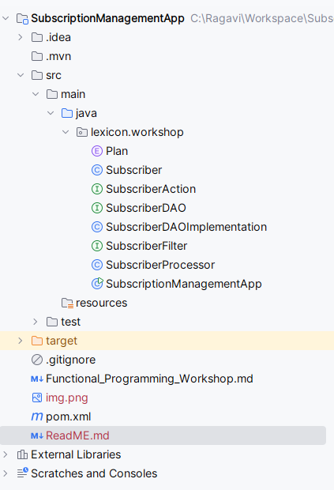
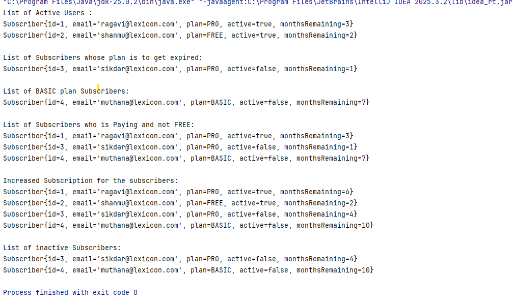

# Subscription Management Application:
This application is a simple subscription list management system which has the core components such as subscribers, subscription plans, and a data access class to store and retrieve subscribers.

### Project Structure:

### Output:
